# wcbb-suite
A suite of skins that I've created or modified to my liking.

Some of the skins may be plug-and-play, but others may require some simple tinkerings with the .ini file.

•Desktop example:

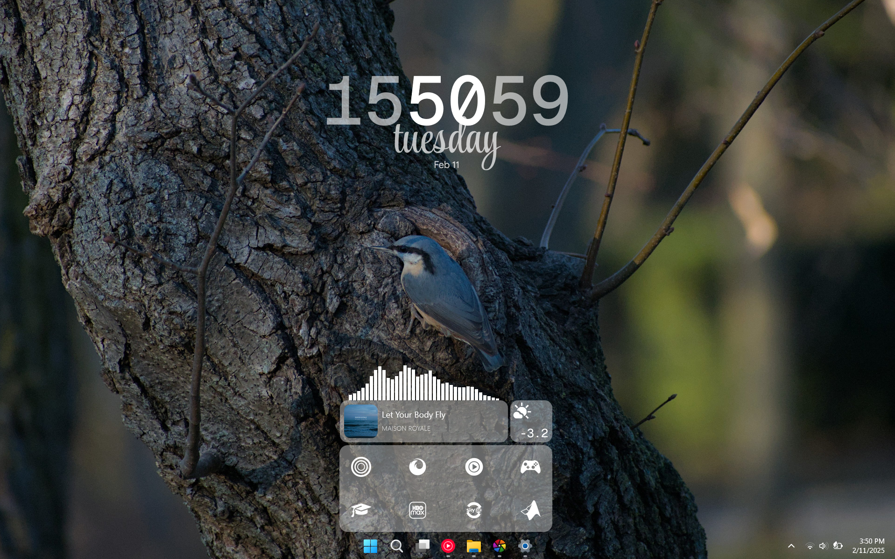

# Colck
Four variantions of a modern clock:

•Simple

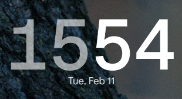

•With seconds

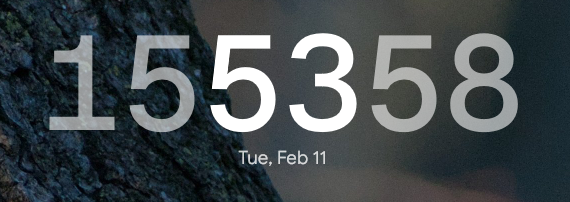

•With week day

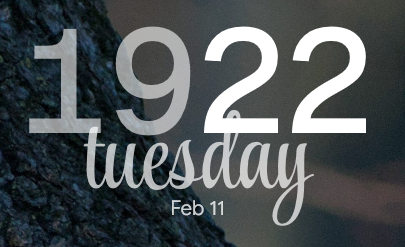

•With week day & seconds

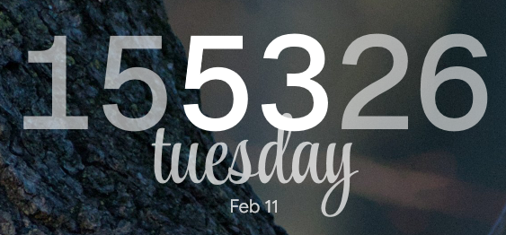

# Simplecisum
Two variations of a music player based on WebNowPlaying (Dosent include the monstercat-visualizer, it can be picked up from the link below):

## Simple

→Playing

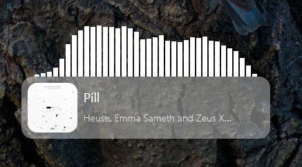

→Paused

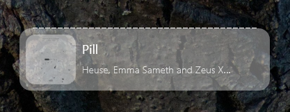

## Resource Intensive
This one has a hover effect over the album cover for play/pause:

→Playing

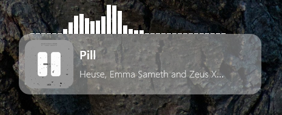

→Paused

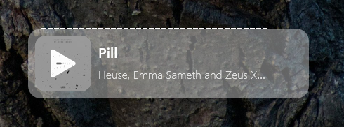

# Icons
Three variations of a simple icon skin (modified from another):

•Simple

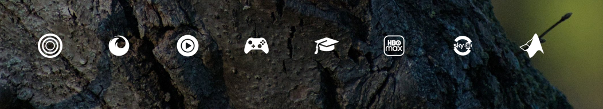

•Taskbar - NEEDS TO BE ADDED

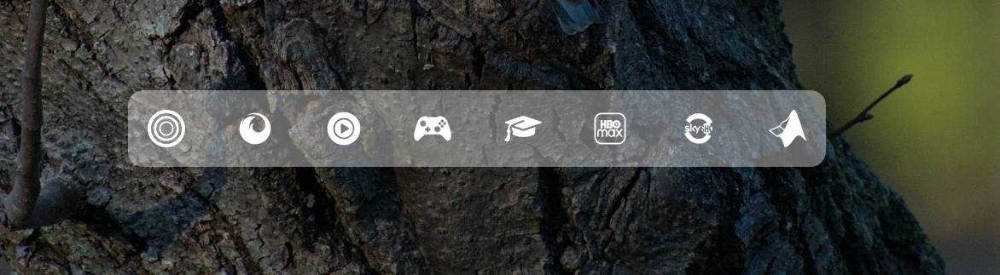

•Dock - NEEDS TO BE ADDED

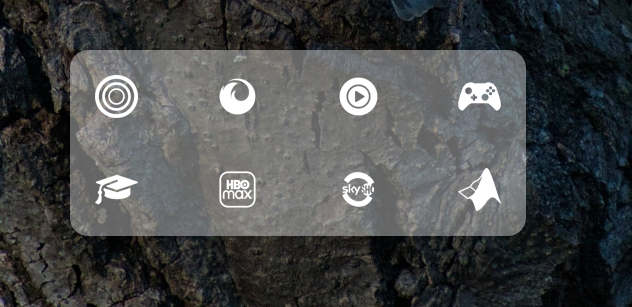

# Veter (WIP)
A weather widget based on open-meteo:

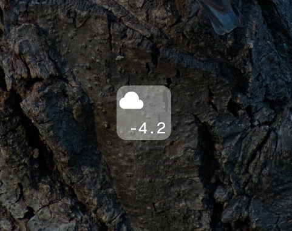

Notice that in the layout (Rainmeter.ini) I've used the monstercat-visualizer for my desktop, but I decided not to bundle it in the WCBB (WinCanBeBeautiful) Suite.

The visualizer can be obtained here: https://github.com/marcopixel/monstercat-visualizer

Verticons should be configured to ones liking.

A Weather widget is in works.

This project is licensed under the terms of the MIT license.
